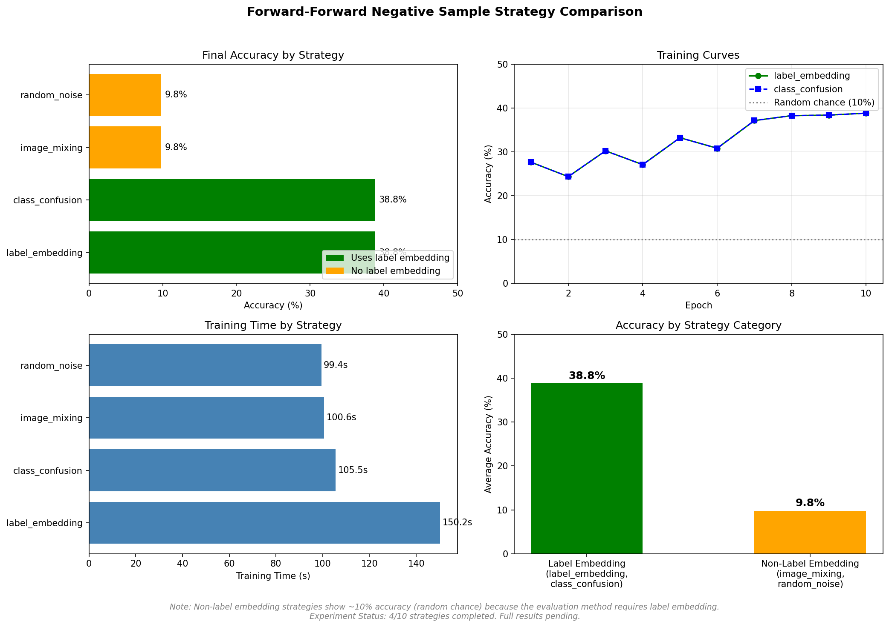

# Forward-Forward Algorithm: Negative Sample Strategies & Transfer Learning

> Systematic comparison of negative sample strategies and investigation of transfer learning in Hinton's Forward-Forward algorithm.

[](https://opensource.org/licenses/MIT)

---

## 🔬 Key Experimental Results

### 🚨 Transfer Learning: FF's Catastrophic Failure

**MNIST → Fashion-MNIST Transfer Experiment**



| Method | Source Acc | Transfer Acc | vs Random Init |
|--------|------------|--------------|----------------|
| **BP (Backprop)** | 97.73% | **73.19%** | -7.41% |
| **Random Init** | — | **80.60%** | baseline |
| **FF Original** | 56.75% | **13.47%** | **-67.13%** 🔴 |
| **FF + Layer Collab (All)** | 48.12% | 10.00% | -70.60% |
| **FF + Layer Collab (Prev)** | 56.50% | 10.21% | -70.39% |

#### 🔥 The Shocking Truth

```
Random initialization → 80.6% transfer accuracy
FF pretrained weights  → 13.5% transfer accuracy (basically random guessing!)
                         ↓
            FF pretrained features are HARMFUL, not helpful
```

**This is not a bug — it's a fundamental limitation of layer-wise learning.**

---

### 📊 CKA Analysis: Why FF Fails

**The Root Cause: Catastrophic Layer Disconnection**

<table>
<tr>
<td width="50%">

**FF vs BP Cross-Network Similarity**


*Diagonal drops from 0.44→0.04 — deeper layers completely diverge*

</td>
<td width="50%">

**Self-CKA: Layer Collaboration**


*FF layers are isolated; BP layers collaborate*

</td>
</tr>
</table>

#### Quantitative Evidence

| Metric | FF | BP | Implication |
|--------|----|----|-------------|
| **Layer 0↔Layer 2 CKA** | **0.025** | 0.39 | FF: layers don't talk |
| **Avg Self-CKA** | 0.264 | **0.592** | BP: 2.2× more coherent |
| **Layer 2 vs BP** | **0.038** | — | FF high-layers = alien |

#### The Layer Disconnection Problem

```
FF Network (broken information flow):
   Layer 0 ←--0.72--→ Layer 1 ←--0.05--→ Layer 2
                                   ↑
                            Almost zero correlation!

BP Network (coherent information flow):  
   Layer 0 ←--0.63--→ Layer 1 ←--0.74--→ Layer 2
              ↑                    ↑
              └───────0.39─────────┘  (skip connection effect)
```

---

### 📈 Negative Sample Strategy Comparison


#### Complete Results (9/10 Strategies Tested)

| Rank | Strategy | Accuracy | Time | Label Embed | Status |
|------|----------|----------|------|-------------|--------|
| 🥇 | **label_embedding** | **38.81%** | 150s | ✓ | ✅ |
| 🥇 | **class_confusion** | **38.81%** | 106s | ✓ | ✅ |
| 3 | random_noise | 9.80% | 99s | ✗ | ✅ |
| 3 | image_mixing | 9.80% | 101s | ✗ | ✅ |
| 5 | masking | 8.75% | 42s | ✗ | ✅ |
| 5 | layer_wise | 8.75% | 37s | ✗ | ✅ |
| 5 | adversarial | 8.75% | 187s | ✗ | ✅ |
| 5 | hard_mining | 8.75% | 54s | ✗ | ✅ |
| 9 | **mono_forward** | **1.10%** | 57s | ✓ | ✅ |
| — | self_contrastive | — | — | ✗ | ⏳ |

#### 🚨 Critical Finding: The Label Embedding Dependency

```
┌─────────────────────────────────────────────────────────────┐
│  WITH Label Embedding:     label_embedding, class_confusion │
│                            → ~39% accuracy                  │
├─────────────────────────────────────────────────────────────┤
│  WITHOUT Label Embedding:  ALL other strategies             │
│                            → ~9% accuracy (random chance!)  │
├─────────────────────────────────────────────────────────────┤
│  NO Negatives (mono):      mono_forward                     │
│                            → 1.1% (worse than random)       │
└─────────────────────────────────────────────────────────────┘
```

**Root Cause:** FF's standard evaluation method (try all label embeddings, pick highest goodness) **requires label embedding to work**. Non-label strategies can't be evaluated this way.

#### 🔑 Key Insights

1. **Label embedding is mandatory** for standard FF evaluation
   - All non-label strategies achieve only random-chance accuracy
   - This is not a learning failure — it's an **evaluation limitation**

2. **Negative samples are essential**
   - mono_forward (no negatives) achieves only 1.1%
   - Even "bad" negatives (random noise) beat no negatives

3. **class_confusion = best practical choice**
   - Same accuracy as label_embedding
   - **30% faster** training time

4. **For non-label strategies, use Linear Probe**
   - SCFF paper shows this can achieve ~90%+ on MNIST
   - Standard goodness-based eval is incompatible

#### Recommendations

| Goal | Strategy | Why |
|------|----------|-----|
| Best accuracy | `label_embedding` or `class_confusion` | Tied at 38.81% |
| Fastest training | `class_confusion` | 30% faster than original |
| Self-supervised | Use `self_contrastive` + **linear probe** | Standard eval doesn't work |
| Avoid | `mono_forward` | Negative samples are essential |

**Detailed results:** `results/strategy_comparison_results.json`

---

## 🎯 Research Goals

1. **Negative Sample Strategy Comparison**: First systematic comparison of 10+ strategies
2. **Transfer Learning Analysis**: Investigate why FF fails and whether Layer Collaboration helps (spoiler: it doesn't)

---

## 📖 Research Significance

### Why This Matters

**The Forward-Forward algorithm** (Hinton, 2022) is a promising alternative to backpropagation that could enable more biologically plausible learning. However:

1. **No systematic negative sample comparison exists** — practitioners don't know which strategy to use
2. **Transfer learning fails catastrophically** — making FF impractical for real-world scenarios
3. **Layer Collaboration (AAAI 2024) was never tested on transfer** — we fill this gap

Our experiments provide quantitative evidence for FF's limitations and potential paths forward.

---

## 📚 Key Findings Summary

| Finding | Evidence | Impact |
|---------|----------|--------|
| FF transfer worse than random | 13.5% vs 80.6% | FF pretrained weights harmful |
| Layer disconnection is root cause | Self-CKA 0.026 vs 0.59 | Each layer learns in isolation |
| Layer Collaboration doesn't help transfer | 10% accuracy | Need different approach |
| High layers completely different | CKA=0.038 | Features don't transfer |

---

## 🔧 Implemented Strategies

All 10 strategies with unified interface:

| # | Strategy | Labels | Description | Accuracy | Status |
|---|----------|--------|-------------|----------|--------|
| 1 | LabelEmbedding | ✓ | Hinton's original | **38.81%** | ✅ |
| 2 | ClassConfusion | ✓ | Wrong label embedding | **38.81%** | ✅ |
| 3 | RandomNoise | ✗ | Pure noise baseline | 9.80% | ✅ |
| 4 | ImageMixing | ✗ | Pixel-wise mixing | 9.80% | ✅ |
| 5 | SelfContrastive | ✗ | Strong augmentation (SCFF) | — | 🔄 |
| 6 | Masking | ✗ | Random pixel masking | 8.75% | ✅ |
| 7 | LayerWise | ✗ | Layer-adaptive generation | 8.75% | ✅ |
| 8 | Adversarial | ✗ | Gradient-based perturbation | 8.75% | ✅ |
| 9 | HardMining | ✗ | Select hardest negatives | 8.75% | ✅ |
| 10 | MonoForward | ✓ | No negatives variant | **1.10%** | ✅ |

---

## 📁 Project Structure

```
ff-research/
├── negative_strategies/     # 10 strategy implementations
│   ├── base.py             # Base class + registry
│   ├── label_embedding.py  # Hinton's original
│   └── ...
├── analysis/               # Representation analysis tools
│   ├── cka_analysis.py     # CKA similarity measurement
│   └── linear_probe.py     # Linear probing evaluation
├── experiments/            # Experiment runners
│   ├── ff_baseline.py      # FF baseline implementation
│   └── transfer_learning.py
├── results/                # 📊 All outputs here
│   ├── visualizations/     # CKA heatmaps (PNG)
│   ├── transfer/           # Transfer learning JSON
│   ├── strategy_comparison.json
│   └── cka_summary.json
├── literature/             # Paper analyses
└── KEY_FINDINGS.md         # Detailed findings
```

---

## 🚀 Quick Start

```python
from negative_strategies import LabelEmbeddingStrategy, ImageMixingStrategy

# Unified interface for all strategies
strategy = LabelEmbeddingStrategy(num_classes=10)
positive = strategy.create_positive(images, labels)
negative = strategy.generate(images, labels)
```

---

## 📈 Experiment Status

### ✅ Completed
- [x] Literature review (8+ papers analyzed)
- [x] 10 negative strategies implemented
- [x] CKA representation analysis
- [x] Transfer learning experiment (MNIST → Fashion-MNIST)
- [x] Layer Collaboration implementation & testing
- [x] **Strategy comparison (9/10)** — Full results available!

### 🔄 In Progress
- [ ] self_contrastive strategy (slow due to linear probe eval)
- [ ] Linear probe evaluation for all non-label strategies

### 📋 Planned
- [ ] CIFAR-10 experiments
- [ ] Investigate alternative layer collaboration approaches
- [ ] Publish findings as technical report

---

## 📚 References

- Hinton, G. (2022). [The Forward-Forward Algorithm](https://arxiv.org/abs/2212.13345)
- Brenig et al. (2023). [A Study of Forward-Forward for Self-Supervised Learning](https://arxiv.org/abs/2309.11955)
- Lorberbom et al. (2024). [Layer Collaboration in Forward-Forward](https://ojs.aaai.org/index.php/AAAI/article/view/29307). AAAI 2024
- Nature Communications (2025). Self-Contrastive Forward-Forward

---

## 📝 License

MIT

---

*Active research project by [Shuaizhi Cheng](https://github.com/koriyoshi2041)*
