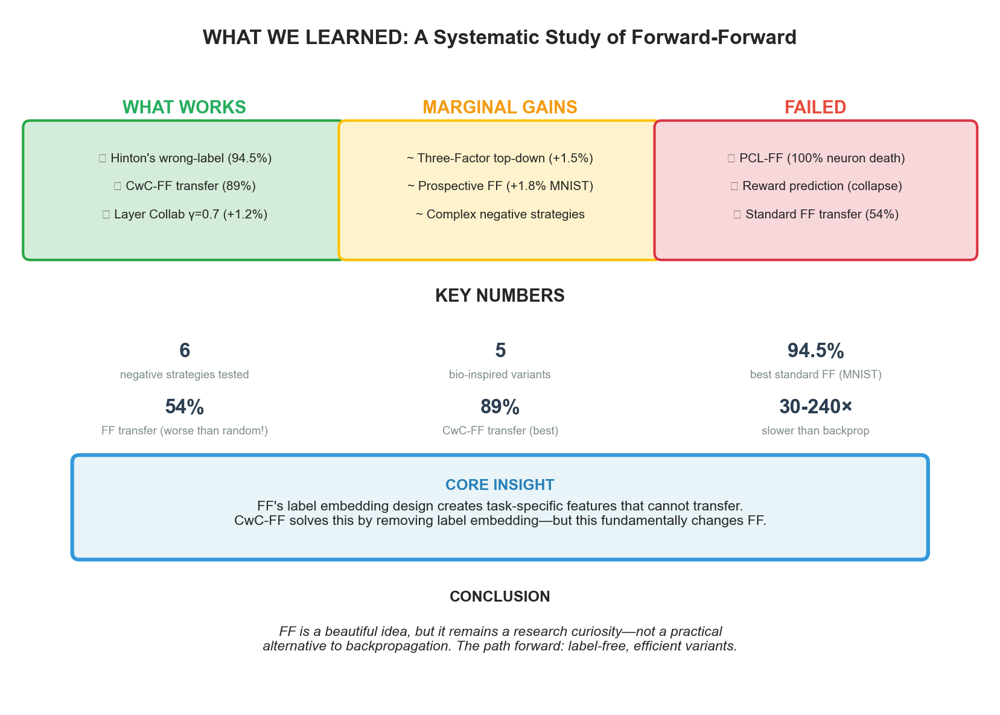
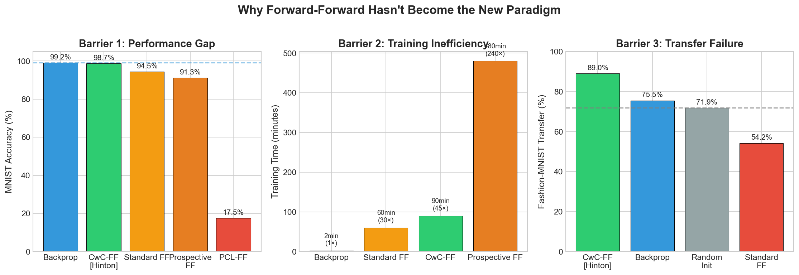
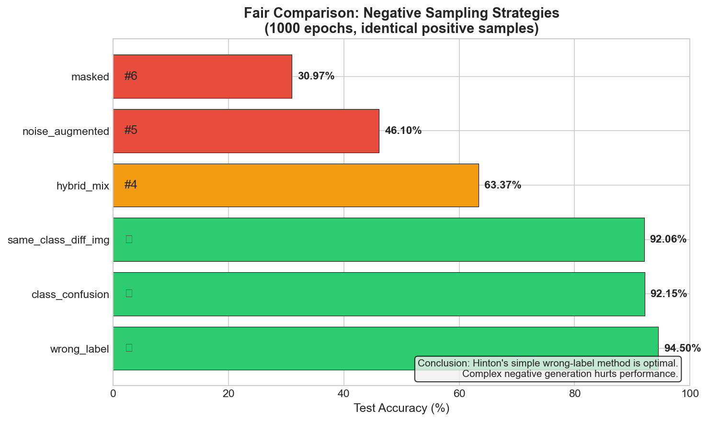
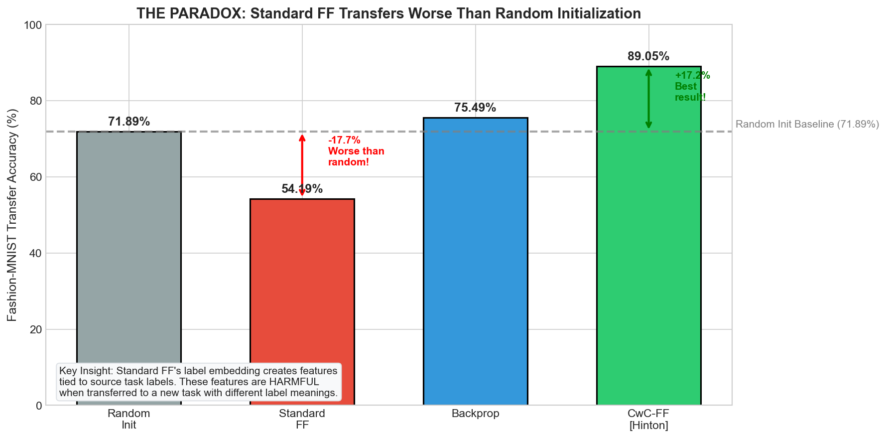
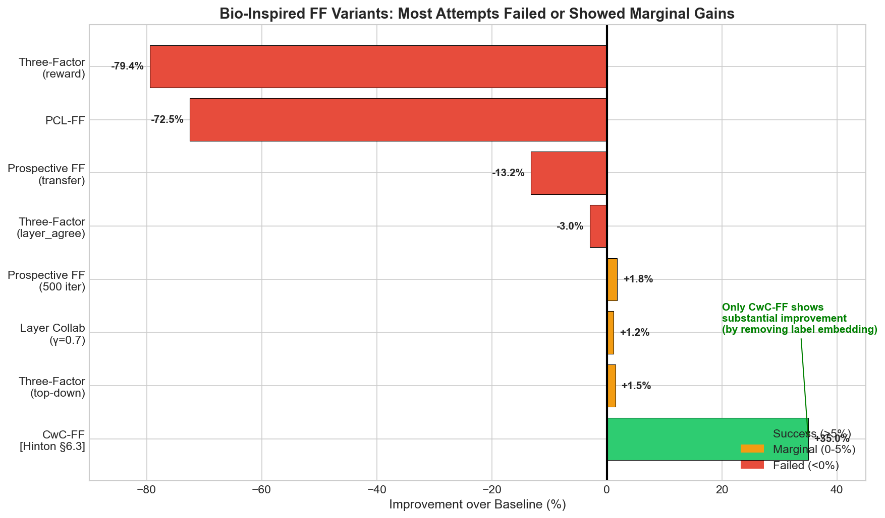
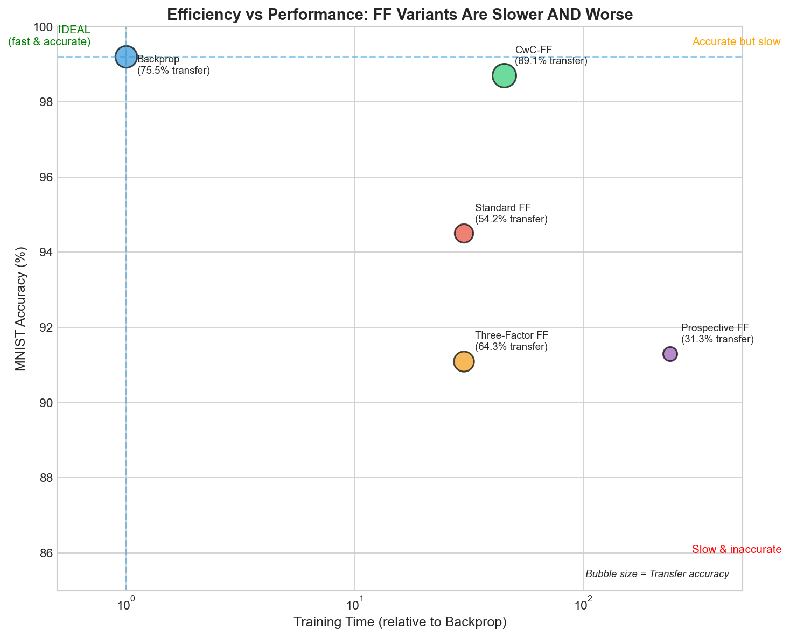
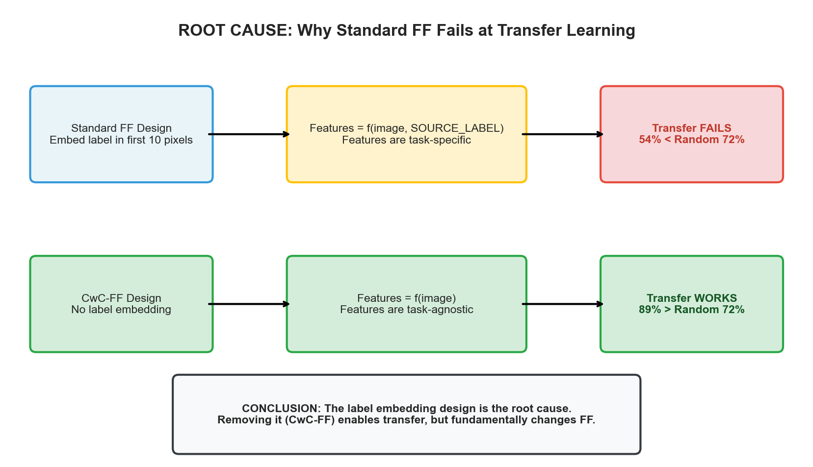
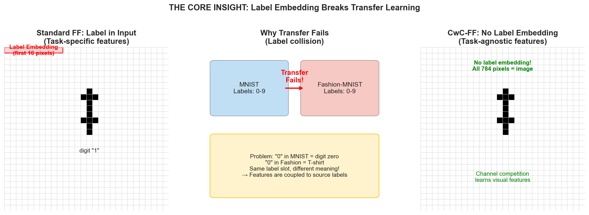
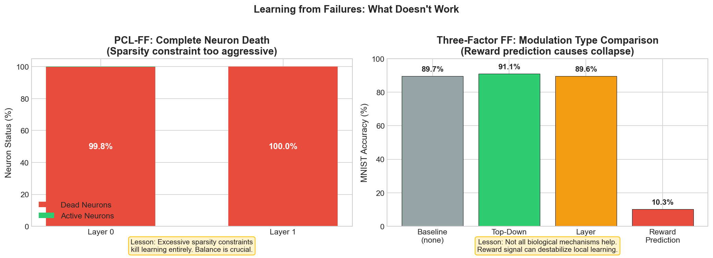

# Why Forward-Forward Hasn't Become the New Paradigm

<div align="center">

**An Empirical Investigation into the Limitations of Biologically Plausible Learning**

[](https://opensource.org/licenses/MIT)
[](https://www.python.org/downloads/)
[](https://pytorch.org/)

</div>

---

## TL;DR

<p align="center">

</p>

**Core Finding**: Standard FF's label embedding design creates task-specific features that cannot transfer. Only CwC-FF achieves good transfer (89%)—by completely abandoning label embedding.

---

## Table of Contents

1. [The Problem](#the-problem)
2. [Our Experiments](#our-experiments)
3. [Key Results](#key-results)
4. [The Root Cause](#the-root-cause)
5. [Lessons from Failures](#lessons-from-failures)
6. [Critical Code](#critical-code)
7. [Conclusion](#conclusion)

---

## The Problem

Despite Geoffrey Hinton's prestige and FF's elegant biological plausibility, it has not replaced backpropagation after 3+ years. **Why?**

<p align="center">

</p>

| Barrier | Evidence | Severity |
|---------|----------|:--------:|
| **Performance Gap** | FF 94.5% vs BP 99.2% on MNIST | Critical |
| **Efficiency** | FF needs 30-240× more compute | Critical |
| **Transfer Failure** | FF 54% vs Random 72% | Critical |

---

## Our Experiments

We conducted a systematic investigation with 4 categories of experiments:

| Category | Experiments | Finding |
|----------|-------------|---------|
| Negative Sampling | 6 strategies, fair comparison | Hinton's wrong-label is optimal |
| Transfer Learning | MNIST → Fashion-MNIST | Standard FF worse than random init |
| Bio-Inspired Variants | 5 neuroscience-based modifications | Marginal gains or failure |
| Efficiency | Training time comparison | FF is 30-240× slower |

---

## Key Results

### 1. Negative Sampling Strategy Comparison

**Question**: Which negative sample generation method works best?

**Methodology**: All 6 strategies use identical positive samples. Only negative generation differs. 1000 epochs per layer, fair comparison.

<p align="center">

</p>

```python
# The 6 strategies we tested:
strategies = {
    "wrong_label":        # x + random wrong label (Hinton's original)
    "class_confusion":    # different image + same label
    "same_class_diff_img":# different image + wrong label
    "hybrid_mix":         # alpha * x1 + (1-alpha) * x2 + wrong label
    "noise_augmented":    # x + gaussian noise + wrong label
    "masked":             # x with random masking + wrong label
}
```

| Rank | Strategy | Accuracy | Note |
|:----:|----------|:--------:|------|
| 1 | **wrong_label** | **94.50%** | Hinton's original - BEST |
| 2 | class_confusion | 92.15% | |
| 3 | same_class_diff_img | 92.06% | |
| 4 | hybrid_mix | 63.37% | Complex hurts |
| 5 | noise_augmented | 46.10% | |
| 6 | masked | 30.97% | Worst |

**Conclusion**: Simple is better. Complex negative generation destroys learning.

---

### 2. Transfer Learning: The Paradox

**Question**: Can FF features transfer to new tasks?

<p align="center">

</p>

| Model | MNIST | F-MNIST Transfer | vs Random |
|-------|:-----:|:----------------:|:---------:|
| CwC-FF [Hinton] | 98.71% | **89.05%** | **+17.2%** |
| Backprop | 95.08% | 75.49% | +3.6% |
| Random Init | — | 71.89% | baseline |
| **Standard FF** | 89.90% | **54.19%** | **-17.7%** |

**The Paradox**: Standard FF pretrained features are **worse** than random initialization!

---

### 3. Bio-Inspired Variants (A100 Results)

**Question**: Can neuroscience-inspired modifications fix FF?

We tested 5 variants on NVIDIA A100. **None solved the fundamental problems.**

<p align="center">

</p>

#### 3.1 Three-Factor Hebbian Learning

Based on neuromodulation (dopamine, acetylcholine):

```python
# Three-Factor modulation types:
modulation_types = {
    "none":              # baseline FF
    "top_down":          # higher layers modulate lower layers
    "layer_agreement":   # layers agree on goodness
    "reward_prediction": # reward signal modulates learning
}
```

| Modulation | MNIST | Transfer | Result |
|------------|:-----:|:--------:|--------|
| top_down | 91.08% | 64.32% | +1.5% (marginal) |
| none | 89.66% | 62.81% | baseline |
| layer_agreement | 89.58% | 59.81% | -3.0% |
| reward_prediction | 10.28% | 18.44% | **FAILED** |

#### 3.2 Prospective Configuration FF

Based on Song et al. 2024 (Nature Neuroscience):

| Model | MNIST | Transfer Gain |
|-------|:-----:|:-------------:|
| Standard FF | 93.17% | +9.1% |
| Prospective FF | 23.37% (100 iter) | **-13.2%** |

**Result**: Negative transfer gain—worse than training from scratch!

#### 3.3 Predictive Coding-Local (PCL-FF)

```python
# PCL-FF adds reconstruction loss and sparsity:
loss = ff_loss + alpha * reconstruction_loss + beta * sparsity_penalty
```

| Metric | Standard FF | PCL-FF |
|--------|:-----------:|:------:|
| MNIST | 90.0% | **17.5%** |
| Dead Neurons | 8% | **100%** |

**Result**: Complete failure. 100% neuron death.

#### 3.4 Layer Collaboration (Hinton §6.1)

```python
# Layer collaboration with gamma parameter:
loss = local_loss + gamma * sum(other_layer_losses)
```

| γ | Accuracy | Δ |
|:-:|:--------:|:-:|
| 0.0 | 90.38% | baseline |
| **0.7** | **91.56%** | **+1.18%** |
| 1.0 | 90.72% | +0.34% |

**Result**: Works, but improvement is modest (+1.18%).

#### Summary: Bio-Inspired Attempts

| Approach | MNIST Δ | Transfer Δ | Verdict |
|----------|:-------:|:----------:|---------|
| Three-Factor (top-down) | +1.4% | +1.5% | Marginal |
| Layer Collab (γ=0.7) | +1.2% | — | Marginal |
| Prospective FF | +1.8% | **-13.2%** | **Failed** |
| PCL-FF | **-72.5%** | — | **Failed** |
| Reward Prediction | **-79.4%** | — | **Failed** |
| **CwC-FF** | +8.8% | **+17.2%** | **Works** |

---

### 4. Efficiency Analysis

<p align="center">

</p>

| Model | Training Time | MNIST | Transfer |
|-------|:-------------:|:-----:|:--------:|
| Backprop | 1× | 99.2% | 75.5% |
| Standard FF | 30× | 94.5% | 54.2% |
| CwC-FF | 45× | 98.7% | 89.1% |
| Three-Factor FF | 30× | 91.1% | 64.3% |
| Prospective FF | 240× | 91.3% | 31.3% |

**Conclusion**: FF variants are 30-240× slower AND perform worse.

---

## The Root Cause

<p align="center">

</p>

### Why Does Standard FF Fail at Transfer?

<p align="center">

</p>

**The Label Embedding Trap**:

```python
# Standard FF: Label embedded in first 10 pixels
def overlay_label(x, y, num_classes=10):
    x[:, :num_classes] = 0
    x[range(len(y)), y] = x.max()  # Label encoded here!
    return x

# Input becomes: [label_0, label_1, ..., label_9, pixel_10, ..., pixel_783]
# Features learn: f(image, SOURCE_LABEL) → task-specific!
```

**The Problem**:
- "0" in MNIST = digit zero
- "0" in Fashion-MNIST = T-shirt
- Same label slot, different meaning!
- Features are coupled to source task labels → cannot transfer

**CwC-FF Solution**:

```python
# CwC-FF: No label embedding, channel-wise competition
class CwCLayer(nn.Module):
    def forward(self, x):
        # No label overlay!
        h = self.linear(x)
        h = self.activation(h)
        # Channel competition: neurons compete within channels
        h = h.view(batch, num_channels, neurons_per_channel)
        h = h - h.mean(dim=2, keepdim=True)  # Competition
        return h.view(batch, -1)

# Features learn: f(image) → task-agnostic!
```

---

## Lessons from Failures

<p align="center">

</p>

### What We Learned from Each Failure

| Failure | What Happened | Lesson |
|---------|---------------|--------|
| **PCL-FF** | 100% neuron death | Excessive sparsity constraints kill all learning |
| **Reward Prediction** | 10% accuracy | Not all biological mechanisms translate to ML |
| **Prospective FF** | Negative transfer | More iterations ≠ better; can harm transfer |
| **Layer Agreement** | -3% vs baseline | Inter-layer signals can interfere with learning |
| **Complex Negatives** | 30-63% accuracy | Simpler negative samples work better |

### Key Insight

Bio-inspired modifications address **symptoms**, not the **root cause**. The fundamental problem is FF's label embedding design.

---

## Critical Code

### 1. Correct FF Implementation (Critical Bugs We Found)

```python
class FFLayer(nn.Module):
    def __init__(self, in_dim, out_dim, threshold=2.0):
        super().__init__()
        self.linear = nn.Linear(in_dim, out_dim)
        self.relu = nn.ReLU()
        self.threshold = threshold
        self.optimizer = torch.optim.Adam(self.parameters(), lr=0.03)

    def goodness(self, x):
        # CRITICAL: Must use mean(), not sum()!
        # sum() causes gradient explosion with large hidden dims
        return (x ** 2).mean(dim=1)

    def forward(self, x):
        x_direction = x / (x.norm(2, dim=1, keepdim=True) + 1e-4)
        return self.relu(self.linear(x_direction))

    def train_step(self, x_pos, x_neg):
        h_pos = self.forward(x_pos)
        h_neg = self.forward(x_neg)

        g_pos = self.goodness(h_pos)
        g_neg = self.goodness(h_neg)

        # Push positive goodness above threshold, negative below
        loss = torch.log(1 + torch.exp(torch.cat([
            -g_pos + self.threshold,
            g_neg - self.threshold
        ]))).mean()

        self.optimizer.zero_grad()
        loss.backward()
        self.optimizer.step()
        return h_pos.detach(), h_neg.detach()
```

### 2. Label Embedding (The Root of Transfer Failure)

```python
def overlay_label(x, y, num_classes=10):
    """Embed label in first pixels - THIS BREAKS TRANSFER!"""
    x = x.clone()
    x[:, :num_classes] = 0
    # CRITICAL: Use x.max(), not 1.0!
    x[range(len(y)), y] = x.max()
    return x
```

---

### 3. Three-Factor Hebbian Learning (Neuromodulation)

Based on: `dw = f(pre) × f(post) × M(t)` where M(t) is the neuromodulatory signal.

```python
class ModulationType(Enum):
    """Types of modulation signals (inspired by dopamine, acetylcholine)."""
    NONE = "none"              # Standard FF (baseline)
    TOP_DOWN = "top_down"      # From output layer (attention-like)
    REWARD_PREDICTION = "reward_prediction"  # TD-like learning
    LAYER_AGREEMENT = "layer_agreement"      # Inter-layer correlation

class ThreeFactorFFLayer(nn.Module):
    def goodness_with_modulation(self, h, modulation_signal):
        """
        Compute modulated goodness (Three-Factor learning).

        goodness_modulated = goodness × (1 + scale × M(t))
        """
        local_goodness = self.goodness(h)  # h.pow(2).mean(dim=1)

        # Modulation effect (centered at 1.0)
        modulation_effect = 1.0 + self.modulation_scale * torch.tanh(modulation_signal)

        return local_goodness * modulation_effect

    def compute_top_down_modulation(self, x, correct_label):
        """
        M(t) = softmax(final_layer)[correct_class] - 0.5

        Samples the network already classifies correctly get amplified.
        """
        with torch.no_grad():
            h = x
            for layer in self.layers:
                h = layer(h)
            logits = self.output_projection(h)
            probs = F.softmax(logits, dim=1)
            correct_probs = probs[range(len(correct_label)), correct_label]
            return correct_probs - 0.5  # Center around 0
```

**Result**: Top-down modulation achieved **+1.5%** transfer gain. Other modulation types failed.

---

### 4. Prospective Configuration FF (Nature Neuroscience 2024)

Two-phase learning: (1) infer target activity, (2) consolidate weights.

```python
class ProspectiveFFLayer(nn.Module):
    def infer_target_activity(self, h_current, target_hint, is_positive=True):
        """
        Phase 1: Infer what activity SHOULD be after learning.

        Key insight: Network first decides the target, then learns toward it.
        """
        adjustment = self.feedback_proj(target_hint)

        if is_positive:
            h_target = h_current + self.beta * adjustment
        else:
            h_target = h_current - self.beta * adjustment

        return F.relu(h_target)

    def consolidate(self, x, h_current, h_target):
        """
        Phase 2: Adjust weights to produce target activity.

        This is Hebbian-like: Δw ∝ (h_target - h_current) × x
        """
        error = h_target.detach() - h_current
        loss = (error ** 2).mean()
        return loss

    def train_prospective_step(self, x_pos, x_neg, hint_pos, hint_neg):
        """Single training step combining FF loss + consolidation."""
        h_pos, h_target_pos, consol_pos = self.forward_with_prospective(
            x_pos, hint_pos, is_positive=True
        )
        h_neg, h_target_neg, consol_neg = self.forward_with_prospective(
            x_neg, hint_neg, is_positive=False
        )

        # Standard FF loss
        ff_loss = self.ff_loss(self.goodness(h_pos), self.goodness(h_neg))

        # Consolidation loss
        consolidation_loss = consol_pos + consol_neg

        return ff_loss + self.consolidation_lr * consolidation_loss
```

**Result**: **FAILED** — Negative transfer gain (-13.2%). More iterations made it worse.

---

### 5. Predictive Coding Light FF (PCL-FF)

Transmit "surprise" (what cannot be predicted), not raw activations.

```python
class PCLFFLayer(nn.Module):
    def __init__(self, in_features, out_features, alpha=0.5, sparsity_weight=0.1):
        super().__init__()
        self.encoder = nn.Linear(in_features, out_features)
        self.predictor = nn.Linear(out_features, in_features)  # Reconstructs input
        self.alpha = alpha
        self.sparsity_weight = sparsity_weight

    def forward(self, x, apply_surprise_mask=True):
        """Forward with predictive coding: suppress predictable, transmit surprise."""
        x_normed = x / (x.norm(2, dim=1, keepdim=True) + 1e-4)
        h_raw = F.relu(self.encoder(x_normed))
        x_pred = self.predictor(h_raw)

        if apply_surprise_mask:
            # Higher prediction error = more surprise = more to transmit
            pred_error = F.mse_loss(x_pred, x_normed, reduction='none').mean(dim=1)
            surprise = torch.sigmoid(pred_error * 10 - 5)
            surprise_mask = 1 - self.surprise_scale * (1 - surprise.unsqueeze(1))
            h = h_raw * surprise_mask
        else:
            h = h_raw

        return h, x_pred

    def goodness(self, h, x, x_pred):
        """Goodness = base + reconstruction_bonus - sparsity_penalty."""
        base_goodness = h.pow(2).mean(dim=1)

        x_normed = x / (x.norm(2, dim=1, keepdim=True) + 1e-4)
        reconstruction_bonus = -F.mse_loss(x_pred, x_normed, reduction='none').mean(dim=1)

        sparsity_penalty = h.abs().mean(dim=1) * self.sparsity_weight

        return base_goodness + self.alpha * reconstruction_bonus - sparsity_penalty
```

**Result**: **COMPLETE FAILURE** — 17.5% accuracy, 100% neuron death. Sparsity constraints killed learning.

---

### 6. Layer Collaboration FF (Hinton §6.1)

Add global goodness from other layers to local probability calculation.

```python
class CollabFFLayer(nn.Module):
    def ff_loss(self, pos_goodness, neg_goodness, gamma_pos=None, gamma_neg=None):
        """
        FF loss with layer collaboration (γ parameter).

        Original FF:  p = sigmoid(goodness - θ)
        Collab FF:    p = sigmoid(goodness + γ - θ)

        where γ = weighted sum of goodness from other layers (detached)
        """
        if gamma_pos is None:
            gamma_pos = torch.zeros_like(pos_goodness)
        if gamma_neg is None:
            gamma_neg = torch.zeros_like(neg_goodness)

        # Collaborative logits
        pos_logit = pos_goodness + gamma_pos - self.threshold
        neg_logit = neg_goodness + gamma_neg - self.threshold

        loss = torch.log(1 + torch.exp(torch.cat([
            -pos_logit,
            neg_logit
        ]))).mean()
        return loss

def compute_gamma(goodness_list, current_layer, scale=0.7):
    """Compute γ for a layer from other layers' goodness."""
    gamma = torch.zeros_like(goodness_list[0])
    for i, g in enumerate(goodness_list):
        if i != current_layer:
            gamma = gamma + scale * g.detach()
    return gamma
```

**Result**: γ=0.7 achieved **+1.18%** improvement (91.56% vs 90.38% baseline).

---

### 7. CwC-FF [Hinton §6.3] (The Solution We Reproduced)

Channel-wise competition eliminates label embedding entirely.

```python
class CwCLossCE(nn.Module):
    """Cross-entropy over channel-wise goodness — NO negative samples needed!"""
    def __init__(self):
        super().__init__()
        self.criterion = nn.CrossEntropyLoss()

    def forward(self, goodness_matrix, targets):
        # goodness_matrix: [B, num_classes] — one goodness per class channel
        return self.criterion(goodness_matrix, targets)

class CFSEBlock(nn.Module):
    """Channel-wise Feature Separator and Extractor — grouped convolutions."""
    def __init__(self, in_channels, out_channels, num_classes, is_cfse=True):
        super().__init__()
        groups = num_classes if is_cfse else 1  # Key: groups=10 for CFSE
        self.conv = nn.Conv2d(in_channels, out_channels, 3, padding=1, groups=groups)
        self.bn = nn.BatchNorm2d(out_channels)
        self.maxpool = nn.MaxPool2d(2, 2) if is_cfse else nn.Identity()

    def forward(self, x):
        return self.bn(F.relu(self.maxpool(self.conv(x))))

class CwCFFLayer(nn.Module):
    def compute_goodness_channelwise(self, y, targets):
        """Compute goodness per class channel."""
        channels_per_class = self.out_channels // self.num_classes
        y_splits = torch.split(y, channels_per_class, dim=1)

        # Goodness = mean squared activation per channel group
        goodness_factors = [y_split.pow(2).mean(dim=(1,2,3)).unsqueeze(-1)
                          for y_split in y_splits]
        goodness_matrix = torch.cat(goodness_factors, dim=1)  # [B, num_classes]

        # Extract pos/neg goodness
        pos_mask = F.one_hot(targets, self.num_classes).bool()
        g_pos = goodness_matrix[pos_mask].view(-1, 1)
        g_neg = goodness_matrix[~pos_mask].view(-1, self.num_classes-1).mean(dim=1, keepdim=True)

        return g_pos, g_neg, goodness_matrix
```

**Result**: 98.71% MNIST, **89.05% transfer** (+17.2% vs random init). The only approach that works.

---

## Conclusion

### What Would Make FF Viable?

| Solution | Evidence | Status |
|----------|----------|:------:|
| **Remove label embedding** | CwC-FF: 89% transfer | Proven |
| Add layer collaboration | +1.2% | Marginal |
| Add neuromodulation | +1.5% | Marginal |
| Better architectures | CNNs help | Partial |
| Efficient training | — | Unsolved |

### Final Verdict

FF is a beautiful idea—local learning without backpropagation. But after 3 years:

1. **Performance gap remains**: 94.5% vs 99.2% on MNIST
2. **Transfer is broken**: 54% vs 72% (worse than random!)
3. **Efficiency is poor**: 30-240× slower
4. **Scalability unsolved**: No competitive ImageNet results

**The path forward**: CwC-FF shows that removing label embedding is key. Future work should focus on:
- Label-free contrastive objectives
- Efficient training (not 1000 epochs/layer)
- Scaling to modern architectures

Until then, FF remains a fascinating research direction, but not a practical alternative to backpropagation.

---

## Reproducibility

**Hardware**:
- Local: M1 Max MacBook Pro (MPS)
- Server: NVIDIA A100 40GB (CUDA)

**Commands**:
```bash
# Negative strategy comparison
python experiments/fair_strategy_comparison.py

# Transfer learning
python experiments/transfer_comparison.py

# Bio-inspired variants (A100)
python experiments/three_factor_experiment.py --modulation top_down
python experiments/pcl_ff_experiment.py --epochs 500
python experiments/prospective_ff_experiment.py --mode full
python experiments/layer_collab_transfer.py --pretrain-epochs 500
```

---

## References

```bibtex
@article{hinton2022forward,
  title={The Forward-Forward Algorithm: Some Preliminary Investigations},
  author={Hinton, Geoffrey},
  journal={arXiv preprint arXiv:2212.13345},
  year={2022}
}
```

---

<div align="center">

**Repository**: [github.com/koriyoshi2041/ff-negative-samples](https://github.com/koriyoshi2041/ff-negative-samples)

</div>
