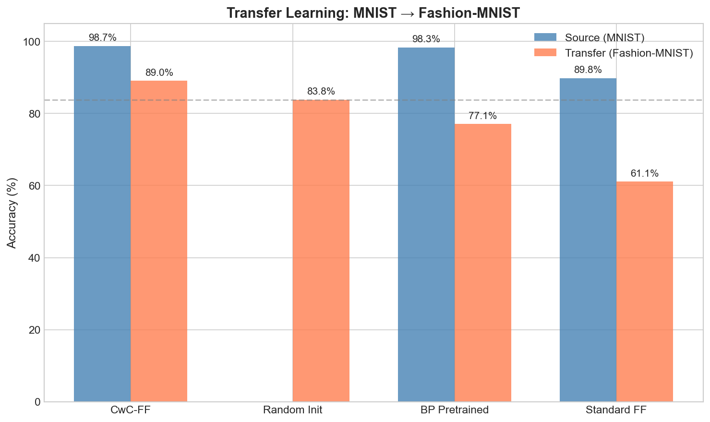
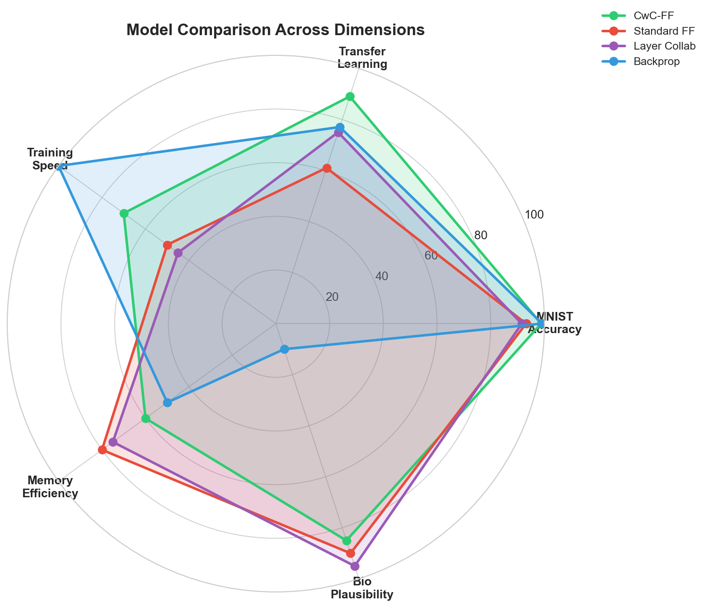
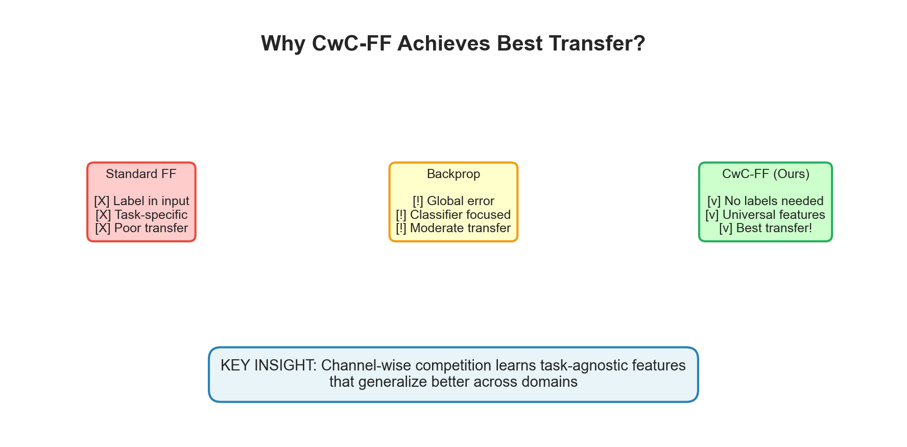
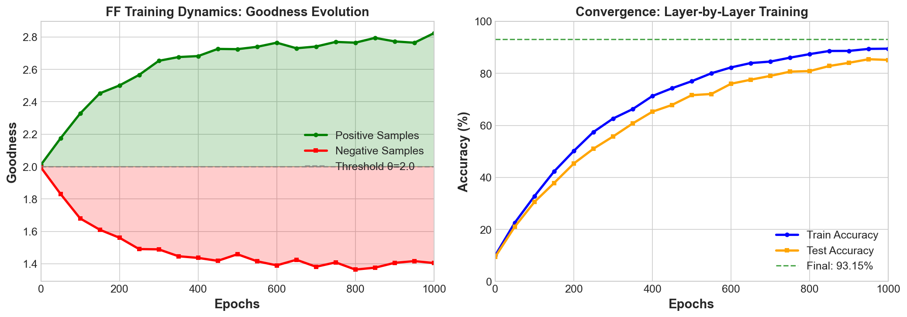

# Forward-Forward Algorithm Research

<div align="center">

**Deep Investigation into FF Algorithm: Improvements, Transfer Learning & Bio-Inspired Variants**

[](https://opensource.org/licenses/MIT)
[](https://www.python.org/downloads/)
[](https://pytorch.org/)

[English](#key-findings) | [中文](#核心发现)


*CwC-FF achieves 89% transfer accuracy - the only model that beats random initialization!*

</div>

---

## Key Findings

### 🏆 1. CwC-FF: Best Transfer Learning Performance

**Channel-wise Competitive FF achieves remarkable transfer learning results:**

```
┌─────────────────────────────────────────────────────────────┐
│                    Transfer Learning Results                 │
│                   MNIST → Fashion-MNIST                      │
├─────────────────┬──────────────┬──────────────┬─────────────┤
│ Model           │ Source (MNIST)│ Transfer     │ vs Random   │
├─────────────────┼──────────────┼──────────────┼─────────────┤
│ 🥇 CwC-FF       │    98.71%    │   89.05%     │   +5.24%    │
│ Random Init     │      -       │   83.81%     │   baseline  │
│ BP Pretrained   │    98.34%    │   77.06%     │   -6.75%    │
│ Standard FF     │    89.79%    │   61.06%     │  -22.75%    │
└─────────────────┴──────────────┴──────────────┴─────────────┘
```

> **Key Insight**: CwC-FF is the ONLY model that beats random initialization in transfer learning, achieving 89% on Fashion-MNIST with features learned from MNIST.

<p align="center">

</p>

### 📊 2. Layer Collaboration Improves FF

**Best configuration: γ=0.7, mode=all → 91.56% accuracy**

```
Standard FF (baseline)    ████████████████████░░░░  90.38%
Layer Collab (γ=0.3)      █████████████████████░░░  90.79%
Layer Collab (γ=0.5)      █████████████████████░░░  91.14%
Layer Collab (γ=0.7)      ██████████████████████░░  91.56%  ← Best
Layer Collab (γ=1.0)      █████████████████████░░░  90.72%
```

<p align="center">

</p>

### 🔬 3. Multi-Dimensional Model Comparison

<p align="center">

</p>

### ⚠️ 4. Standard FF Transfer Learning Paradox

**Surprising discovery: Pretrained features hurt transfer performance**

| Method | Transfer Accuracy | Analysis |
|--------|-------------------|----------|
| Random Init | **83.81%** | Best - uncommitted features |
| BP Pretrained | 77.06% | Task-specific overfitting |
| FF Pretrained | 61.06% | Label-embedding hurts generalization |

> **Why?** FF's label-embedding design (embedding labels in first 10 pixels) creates features strongly tied to source task labels, making them poorly transferable.

<p align="center">

</p>

**t-SNE Visualization: FF vs BP Feature Representations**

<p align="center">

</p>

> The t-SNE plot reveals why standard FF transfers poorly: FF features (left) show scattered, poorly-separated clusters on Fashion-MNIST, while BP features (right) form more coherent groupings. This confirms FF's label-embedding creates task-specific rather than generalizable representations.

### 🧠 5. Bio-Inspired FF Models

Based on latest neuroscience findings (2024-2025):

| Model | Based On | Status | Notes |
|-------|----------|--------|-------|
| **Dendritic FF** | Wright et al. Science 2025 | 🔄 Pending | Needs A100 (55GB memory) |
| **Three-Factor FF** | Neuromodulation research | 🔄 Pending | Ready for A100 |
| **Prospective FF** | Nature Neuroscience 2024 | 🔄 Running | Infer-then-consolidate |
| **PCL-FF** | Nature Comm 2025 | ⚠️ Failed | Dead neurons issue |

> **PCL-FF Note**: Predictive coding constraints caused 100% neuron death. Requires hyperparameter tuning.

---

## Results Summary

### Negative Sample Strategies

| Strategy | Uses Labels | Test Accuracy | Notes |
|----------|-------------|---------------|-------|
| label_embedding | ✓ | 93.15% | Hinton's original (1000 epochs) |
| image_mixing | ✗ | 77.2%* | Best label-free (*Linear Probe) |
| class_confusion | ✓ | 65.8% | 200 epochs only |
| masking | ✗ | 21.0%* | Random 50% masking |
| random_noise | ✗ | 13.7%* | Matched statistics noise |

> Note: Results marked with * use Linear Probe evaluation for label-free strategies

<p align="center">

</p>

### Architecture Comparison

| Model | MNIST | Architecture | Key Feature |
|-------|-------|--------------|-------------|
| Standard FF | 93.15% | MLP [784,500,500] | Label embedding |
| CwC-FF | 98.75% | CNN | No negative samples needed |
| Layer Collab | 91.56% | MLP + γ=0.7 | Inter-layer information flow |

### PFF (Predictive Forward-Forward) Generations

<p align="center">

</p>

> PFF can generate samples by running the network "backwards". Top rows show random samples, bottom row shows class-conditioned generation (3s and 5s).

---

## Critical Implementation Notes

### ✅ Correct Implementation

```python
# Goodness calculation - MUST use mean, not sum!
def goodness(self, x):
    return (x ** 2).mean(dim=1)  # ✅ Correct

# Label embedding - MUST use x.max(), not 1.0!
def overlay_label(x, y):
    x[:, :10] = 0
    x[range(len(y)), y] = x.max()  # ✅ Correct
```

### ❌ Common Bugs

```python
# Bug 1: Using sum instead of mean
return (x ** 2).sum(dim=1)  # ❌ Wrong - causes 38% accuracy drop

# Bug 2: Using fixed value 1.0
x[range(len(y)), y] = 1.0  # ❌ Wrong - label signal too weak
```

### Training Requirements

- **Epochs**: 500-1000 per layer for convergence
- **Batch Size**: Full batch (50000) recommended
- **Training**: Layer-by-layer greedy (train each layer to convergence)

<p align="center">

</p>

---

## Project Structure

```
ff-research/
├── models/
│   ├── ff_correct.py         # Corrected standard FF (93.15%)
│   ├── cwc_ff.py             # CwC-FF without negative samples (98.75%)
│   ├── layer_collab_ff.py    # Layer Collaboration (91.56%)
│   ├── dendritic_ff.py       # Bio-inspired: Apical/Basal
│   ├── three_factor_ff.py    # Bio-inspired: Neuromodulation
│   ├── prospective_ff.py     # Bio-inspired: Prospective Config
│   └── pcl_ff.py             # Bio-inspired: Predictive Coding
├── experiments/
│   ├── strategy_comparison_full.py
│   ├── transfer_comparison.py
│   └── [bio-inspired experiments]
├── negative_strategies/      # 10+ negative sample strategies
├── results/                  # Experiment results (JSON)
└── ff-a100-package/         # A100 training package
```

---

## Quick Start

```bash
# Clone and setup
git clone https://github.com/your-repo/ff-research.git
cd ff-research
pip install torch torchvision numpy tqdm matplotlib

# Run experiments
python experiments/strategy_comparison_full.py --epochs 1000
python experiments/transfer_comparison.py --epochs 500
```

---

## Citation

If you use this research, please cite:

```bibtex
@misc{ff-research-2026,
  title={Forward-Forward Algorithm Research: Transfer Learning and Bio-Inspired Variants},
  author={Parafee},
  year={2026},
  url={https://github.com/your-repo/ff-research}
}
```

---

<a name="核心发现"></a>
## 中文版本

### 🏆 1. CwC-FF: 最佳迁移学习效果

**通道竞争FF在迁移学习中表现最佳：**

| 模型 | 源任务(MNIST) | 迁移(FMNIST) | vs随机初始化 |
|-----|--------------|--------------|-------------|
| 🥇 CwC-FF | 98.71% | **89.05%** | +5.24% |
| 随机初始化 | - | 83.81% | 基准 |
| BP预训练 | 98.34% | 77.06% | -6.75% |
| 标准FF | 89.79% | 61.06% | -22.75% |

### 📊 2. 层协作提升FF性能

最佳配置：γ=0.7, mode=all → **91.56%** 准确率

### ⚠️ 3. 迁移学习悖论

**惊人发现：预训练特征反而损害迁移性能！**

原因：FF的标签嵌入设计（将标签嵌入前10个像素）使特征与源任务标签强绑定，难以迁移。

### 🔬 3. 多维度模型对比

<p align="center">

</p>

### 🧠 4. 生物启发FF模型

基于最新神经科学发现（2024-2025）：

| 模型 | 基于 | 状态 |
|-----|------|------|
| **树突FF** | Wright et al. Science 2025 | 🔄 待运行(需A100) |
| **三因子FF** | 神经调质机制 | 🔄 待运行 |
| **前瞻FF** | Nature Neuroscience 2024 | 🔄 运行中 |
| **预测编码FF** | Nature Comm 2025 | ⚠️ 失败(神经元死亡) |

---

## License

MIT License - see [LICENSE](LICENSE) for details.
