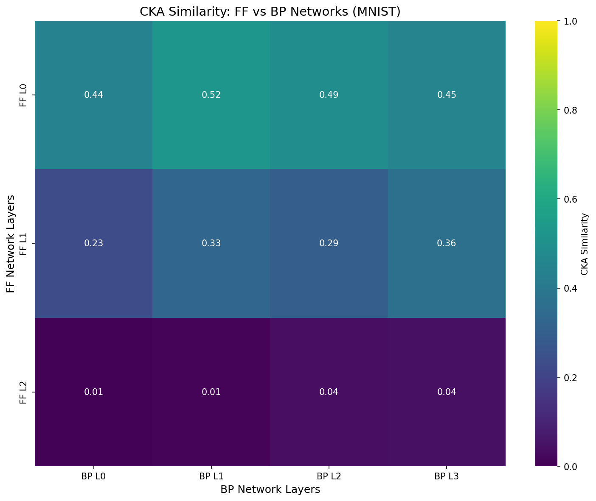
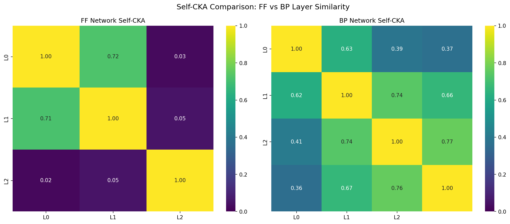

# Forward-Forward Algorithm: Negative Sample Strategies & Transfer Learning

> Systematic comparison of negative sample strategies and investigation of transfer learning in Hinton's Forward-Forward algorithm.

[](https://opensource.org/licenses/MIT)

## 🎯 Research Goals

1. **Negative Sample Strategy Comparison**: First systematic comparison of 10+ negative sample generation strategies for FF algorithm
2. **Transfer Learning Analysis**: Investigate why FF fails at transfer learning and potential solutions (Layer Collaboration, etc.)

## 📖 Research Significance

### Why Systematic Negative Sample Comparison Matters

The Forward-Forward algorithm's performance is fundamentally tied to the quality of negative samples — yet **no prior work has systematically compared different strategies**. Hinton's original paper proposed label embedding, but subsequent works introduced mixing, masking, self-contrastive, and even negative-free variants (MonoForward, CwComp) without head-to-head comparison. This gap leaves practitioners without guidance on which strategy to use and researchers without understanding of *why* certain approaches work better. Our systematic comparison across 10 strategies aims to: (1) establish empirical baselines, (2) identify which properties make negatives effective (hardness? diversity? distribution gap?), and (3) inform the design of next-generation strategies.

### Why Layer Collaboration + Transfer Learning is a Critical Gap

Brenig et al. (2023) demonstrated that FF's transfer learning performance "significantly lags behind BP in ALL studied settings" — with gaps up to 38.9%. They attributed this to FF's layer-wise loss functions discarding information unnecessary for the current task. The Layer Collaboration mechanism (AAAI 2024) was proposed to address FF's layer isolation problem by introducing global goodness signals. **However, the Layer Collaboration paper did not test transfer learning.** This is a critical gap: if layer collaboration improves information flow between layers, it *should* help preserve transferable features — but this hypothesis remains untested. Our work fills this gap by directly measuring whether Layer Collaboration improves FF's transfer learning, potentially identifying a path to make FF practically useful for real-world scenarios where pre-training and fine-tuning are essential.

## 📊 Key Findings

### CKA Representation Analysis Results

**FF vs BP Layer Similarity**


**Self-CKA Comparison: FF layers are disconnected**


| Metric | Value | Implication |
|--------|-------|-------------|
| FF vs BP Layer 0 CKA | 0.444 | Early layers similar |
| FF vs BP Layer 2 CKA | **0.038** | ⚠️ High layers completely different |
| **FF L0↔L2 Self-CKA** | **0.025** | ⚠️ **Catastrophic layer disconnection** |
| FF Self-CKA (avg) | 0.264 | Layer disconnection |
| BP Self-CKA (avg) | 0.592 | Information flows well |

**Core Insight**: FF's transfer failure is caused by **catastrophic layer disconnection**:
- FF Layer 0 ↔ Layer 2 CKA = **0.025** (almost completely independent!)
- BP's minimum cross-layer CKA = 0.36 (14× higher)
- High layers learn features with no connection to early layers, making transfer impossible

This validates the need for Layer Collaboration to restore information flow.

### Why FF Fails at Transfer Learning (Brenig et al., 2023)
- FF matches BP on source task training, but **transfer performance significantly lags behind** (up to 38.9% gap)
- Root cause: Layer-wise loss functions discard information "unnecessary" for current task
- **Insight**: The problem isn't FF itself, but the training objective design

### Layer Collaboration (AAAI 2024)
- Adds global goodness term (γ) to local optimization
- Improves MNIST error from 3.3% → 2.1%
- **Gap**: Transfer learning NOT tested — we fill this gap

### State-of-the-Art (2024-2025)
| Method | Source | Innovation | CIFAR-10 |
|--------|--------|------------|----------|
| CwComp | AAAI 2024 | No negative samples needed | 78% |
| SCFF | Nature 2025 | Self-contrastive, no labels | ~70% |
| Distance-FF | arXiv 2024 | Metric learning | SOTA |

## 🔧 Implemented Strategies

All 10 strategies with unified interface:

| # | Strategy | Labels Required | Description |
|---|----------|-----------------|-------------|
| 1 | LabelEmbedding | ✓ | Hinton's original method |
| 2 | ImageMixing | ✗ | Pixel-wise mixing of images |
| 3 | RandomNoise | ✗ | Pure noise baseline |
| 4 | ClassConfusion | ✓ | Correct image + wrong label |
| 5 | SelfContrastive | ✗ | Strong augmentation (SCFF) |
| 6 | Masking | ✗ | Random pixel masking |
| 7 | LayerWise | ✗ | Layer-adaptive generation |
| 8 | Adversarial | ✗ | Gradient-based perturbation |
| 9 | HardMining | ✓ | Select hardest negatives |
| 10 | MonoForward | ✓ | No negatives variant |

## 📁 Project Structure

```
ff-research/
├── negative_strategies/     # 10 strategy implementations
│   ├── base.py             # Base class + registry
│   ├── label_embedding.py
│   ├── image_mixing.py
│   └── ...
├── analysis/               # Representation analysis
│   ├── cka_analysis.py     # CKA similarity
│   └── linear_probe.py     # Linear probing
├── experiments/            # Experiment scripts
│   └── ff_baseline.py      # Verified FF baseline (93%+ on MNIST)
├── literature/             # Paper analyses
│   ├── brenig2023_analysis.md
│   ├── lorberbom2024_layer_collab.md
│   └── opensource_survey.md
└── KEY_FINDINGS.md         # Summary of discoveries
```

## 🚀 Quick Start

```python
from negative_strategies import LabelEmbeddingStrategy, ImageMixingStrategy

# Unified interface
strategy = LabelEmbeddingStrategy(num_classes=10)
positive = strategy.create_positive(images, labels)
negative = strategy.generate(images, labels)
```

## 📈 Experiment Status

- [x] Literature review complete
- [x] 10 negative strategies implemented
- [x] CKA/Linear Probe code ready
- [ ] MNIST strategy comparison (running)
- [ ] Layer Collaboration implementation
- [ ] Transfer learning experiments
- [ ] CIFAR-10 experiments

## 📚 References

- Hinton, G. (2022). The Forward-Forward Algorithm. arXiv:2212.13345
- Brenig et al. (2023). A Study of Forward-Forward for Self-Supervised Learning. arXiv:2309.11955
- Lorberbom et al. (2024). Layer Collaboration in Forward-Forward. AAAI 2024
- Nature Communications (2025). Self-Contrastive Forward-Forward

## 📝 License

MIT

---

*Active research project by [Shuaizhi Cheng](https://github.com/koriyoshi2041)*
