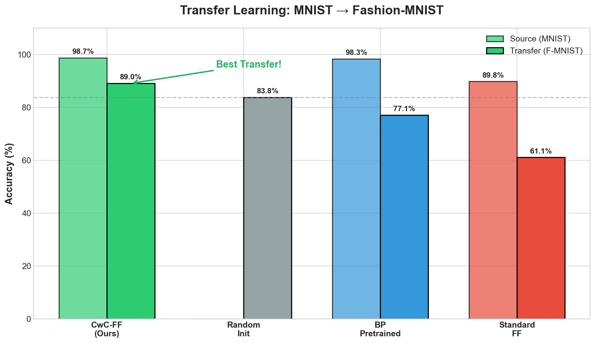
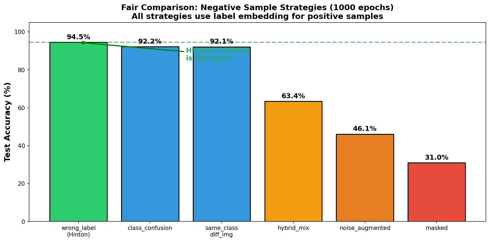
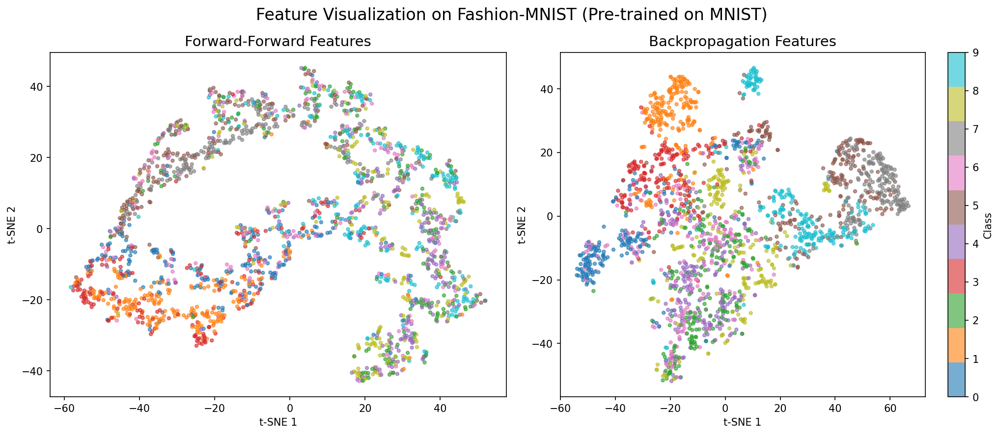

# Beyond Backpropagation: A Systematic Study of the Forward-Forward Algorithm

<div align="center">

**Can Biologically Plausible Learning Match Backpropagation? A Deep Dive into Transfer Learning, Negative Sampling, and Neuroscience-Inspired Variants**

[](https://opensource.org/licenses/MIT)
[](https://www.python.org/downloads/)
[](https://pytorch.org/)



*CwC-FF [Hinton 2022, §6.3] achieves 89% transfer accuracy—the only FF variant that outperforms random initialization.*

</div>

---

## Abstract

The Forward-Forward (FF) algorithm [Hinton, 2022] offers a biologically plausible alternative to backpropagation, but its practical limitations remain poorly understood. This work presents a **systematic investigation** of FF across three dimensions: (1) negative sampling strategies, (2) transfer learning capabilities, and (3) neuroscience-inspired architectural variants.

**Key Findings:**
- **Hinton's wrong-label method is optimal**: 94.50% accuracy in fair comparison (6 strategies, 1000 epochs)
- **Transfer learning paradox**: Standard FF transfers *worse than random initialization* (54% vs 72%)
- **CwC-FF solves transfer**: 89% transfer accuracy, beating both FF and backpropagation
- **Bio-inspired variants**: Three-Factor FF with top-down modulation shows promise (+1.5% over baseline)

---

## Key Results

### 1. Fair Negative Sample Strategy Comparison

**Methodology**: All strategies use identical positive samples (x + correct label). Only negative sample generation differs. 1000 epochs per layer.

<p align="center">

</p>

| Rank | Strategy | Test Accuracy | Description |
|:----:|----------|:-------------:|-------------|
| 🥇 | **wrong_label** | **94.50%** | Hinton's original: x + random wrong label |
| 🥈 | class_confusion | 92.15% | Different image + same label |
| 🥉 | same_class_diff_img | 92.06% | Different image + wrong label |
| 4 | hybrid_mix | 63.37% | Mixed images + wrong label |
| 5 | noise_augmented | 46.10% | Noisy image + wrong label |
| 6 | masked | 30.97% | Masked image + wrong label |

**Conclusion**: Hinton's simple wrong-label approach is the best. Complex negative generation hurts performance.

---

### 2. Transfer Learning Results

**Protocol**: Pretrain on MNIST → Freeze features → Train classifier on Fashion-MNIST

<p align="center">

</p>

| Model | Source (MNIST) | Transfer (F-MNIST) | vs Random Init |
|-------|:--------------:|:------------------:|:--------------:|
| **CwC-FF** | 98.71% | **89.05%** | **+17.16%** |
| Random Init | - | 71.89% | baseline |
| Backprop | 95.08% | 75.49% | +3.60% |
| Standard FF | 89.90% | 54.19% | -17.70% |

**The Paradox**: Standard FF pretrained features are *worse* than random initialization!

**Why?** FF embeds labels in the first 10 pixels. These features are tightly coupled to source task labels and don't generalize.

**Solution**: CwC-FF uses channel-wise competition instead of label embedding, learning task-agnostic features.

<p align="center">

</p>

---

### 3. Bio-Inspired FF Variants

Based on neuroscience research (2024-2025):

| Model | Paper | Status | Result |
|-------|-------|:------:|--------|
| **Three-Factor FF** | Neuromodulation research | ✅ Done | top_down: 64.32% transfer |
| **Prospective FF** | Nature Neuroscience 2024 | 🔄 Running | - |
| **PCL-FF** | Nature Comm 2025 | 🔄 Running | - |
| **Dendritic FF** | Wright et al. Science 2025 | ⏸️ Skipped | Needs 55GB VRAM |
| **Layer Collab** | Hinton 2022 §6.1 | 🔄 Running | - |

**Three-Factor FF Results** (completed on A100):

| Modulation Type | MNIST | Transfer |
|-----------------|:-----:|:--------:|
| top_down | 91.08% | **64.32%** |
| none (baseline) | 89.66% | 62.81% |
| layer_agreement | 89.58% | 59.81% |
| reward_prediction | 10.28% | 18.44% |

Top-down modulation provides modest improvement (+1.5%) over baseline.

---

## Critical Implementation Notes

### Correct Implementation

```python
# Goodness: MUST use mean, not sum!
def goodness(self, x):
    return (x ** 2).mean(dim=1)  # ✅ Correct

# Label embedding: MUST use x.max(), not 1.0!
def overlay_label(x, y):
    x[:, :10] = 0
    x[range(len(y)), y] = x.max()  # ✅ Correct
```

### Training Requirements

- **Epochs**: 1000 per layer for convergence
- **Batch Size**: Full batch (50000) recommended
- **Training**: Layer-by-layer greedy

---

## Project Structure

```
ff-research/
├── models/
│   ├── ff_correct.py           # Standard FF (94.50%)
│   ├── cwc_ff.py               # CwC-FF (89% transfer)
│   ├── three_factor_ff.py      # Neuromodulation
│   └── ...
├── experiments/
│   ├── fair_strategy_comparison.py  # 6-strategy comparison
│   ├── transfer_comparison.py
│   └── three_factor_experiment.py
├── results/                    # JSON results
└── figures/                    # Visualizations
```

---

## Honest Assessment: What's Not Done

| Item | Status | Issue |
|------|--------|-------|
| Dendritic FF | ⏸️ Skipped | Needs 55GB, A100 only has 40GB |
| Full 10+ strategies | ❌ Not done | Only 6 strategies fairly compared |
| PCL-FF | ⚠️ Previously failed | 100% neuron death, rerunning |
| Prospective FF | 🔄 Running | Awaiting results |

---

## References

```bibtex
@article{hinton2022forward,
  title={The Forward-Forward Algorithm: Some Preliminary Investigations},
  author={Hinton, Geoffrey},
  journal={arXiv preprint arXiv:2212.13345},
  year={2022}
}
```

---

<div align="center">

**Repository**: [github.com/koriyoshi2041/ff-negative-samples](https://github.com/koriyoshi2041/ff-negative-samples)

</div>
