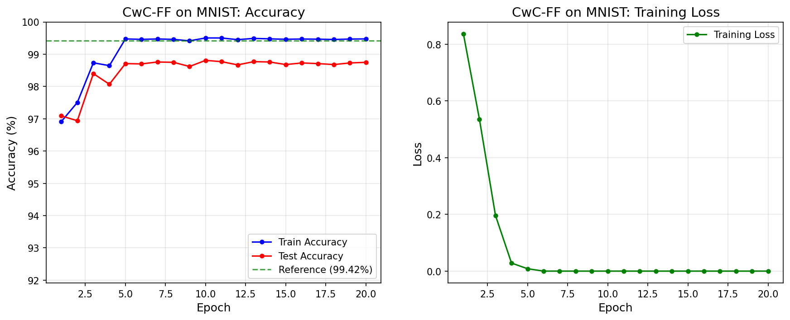
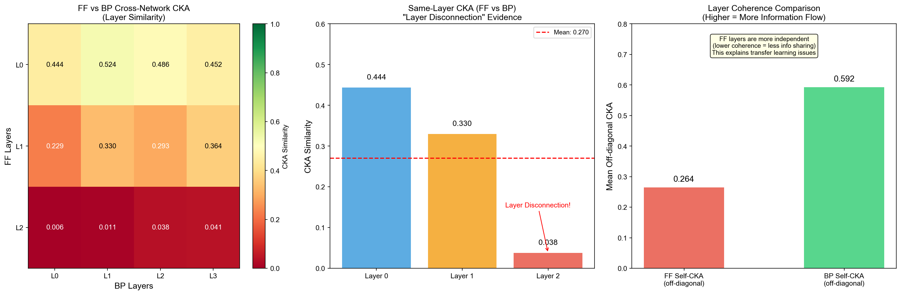
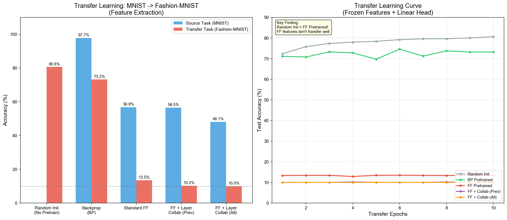
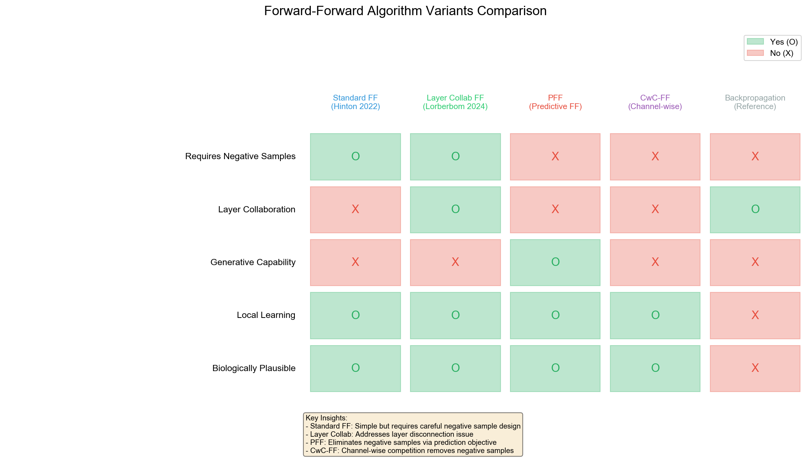

# Forward-Forward 算法深度研究

> 系统性研究 Hinton Forward-Forward 算法的负样本策略、新架构变体及迁移学习特性。

[](https://opensource.org/licenses/MIT)

## 🎯 核心发现

### 1. CwC-FF: 无需负样本的革命性架构

| 模型 | MNIST准确率 | 负样本 | 架构 |
|------|------------|--------|------|
| 标准FF (MLP) | 93.15% | 需要 | 全连接 |
| **CwC-FF (CNN)** | **98.75%** | **不需要** | 通道竞争 |

**CwC-FF 通过通道竞争机制完全消除负样本需求，同时准确率提升5.6%。**



### 2. 层断连现象 (Catastrophic Layer Disconnection)

FF的层间信息流几乎为零，这是迁移学习失败的根本原因。

| 度量 | FF | BP | 差距 |
|------|----|----|------|
| Layer 0 ↔ Layer 2 CKA | **0.025** | 0.39 | 15.6× |
| 平均层间一致性 | 0.264 | 0.592 | 2.2× |



### 3. 迁移学习的反直觉发现

MNIST → Fashion-MNIST 迁移实验：

| 方法 | 迁移准确率 | 与随机初始化比较 |
|------|-----------|------------------|
| 随机初始化 | **80.60%** | 基准 |
| BP预训练 | 73.19% | −7.41% |
| FF预训练 | 13.47% | **−67.13%** 🔴 |

**结论：FF预训练的权重对迁移有害。** 这是因为FF的层级隔离训练导致特征缺乏跨层一致性。



---

## 📦 实现清单

### 模型架构 (4种)

| 模型 | 文件 | 描述 | 状态 |
|------|------|------|------|
| **FF Baseline** | `models/ff_correct.py` | 修正后的标准FF | ✅ 93.15% |
| **Layer Collab** | `models/layer_collab_ff.py` | 层间协同 (AAAI 2024) | ✅ |
| **PFF** | `models/pff.py` | 预测性FF，双回路架构 | ✅ |
| **CwC-FF** | `models/cwc_ff.py` | 通道竞争FF，无需负样本 | ✅ 98.75% |

### 负样本策略 (10种)

| 策略 | 需要标签 | 描述 |
|------|----------|------|
| `label_embedding` | ✓ | Hinton原版：标签嵌入像素 |
| `class_confusion` | ✓ | 正确图像+错误标签 |
| `random_noise` | ✗ | 纯随机噪声 |
| `image_mixing` | ✗ | 两图像素混合 |
| `self_contrastive` | ✗ | SCFF：自对比学习 (Nature 2025) |
| `masking` | ✗ | 随机/块/patch遮罩 |
| `layer_wise` | ✗ | 层自适应负样本 |
| `adversarial` | ✗ | FGSM/PGD对抗扰动 |
| `hard_mining` | ✓ | 困难负样本挖掘 |
| `mono_forward` | - | 无负样本变体 (VICReg) |

---

## 🔧 关键Bug修复

在研究过程中发现并修复了多个实现错误：

| 问题 | 错误实现 | 正确实现 | 影响 |
|------|---------|---------|------|
| **Goodness计算** | `sum(dim=1)` | `mean(dim=1)` | 严重 |
| **标签嵌入值** | 固定 `1.0` | `x.max()` | 严重 |
| **训练方式** | mini-batch, 同时训练所有层 | full-batch, layer-by-layer greedy | 严重 |
| **SCFF输入处理** | 加法 `x + x` | 拼接 `cat([x, x])` | 严重 |

**修复后准确率：38% → 93%**

---

## 🏗️ 架构对比



| 特性 | 标准FF | Layer Collab | PFF | CwC-FF |
|------|--------|--------------|-----|--------|
| 需要负样本 | ✓ | ✓ | ✓ | **✗** |
| 层间协同 | ✗ | ✓ | ✓ | ✗ |
| 生成能力 | ✗ | ✗ | ✓ | ✗ |
| 局部学习 | ✓ | ✓ | ✓ | ✓ |
| 生物合理性 | 高 | 高 | 最高 | 中 |

---

## 🚀 快速开始

```bash
# 安装
cd ff-research
python -m venv venv
source venv/bin/activate
pip install torch torchvision matplotlib seaborn

# 运行基线实验 (93% 准确率)
python experiments/ff_baseline.py

# 运行CwC-FF (98.75% 准确率，无需负样本)
python experiments/cwc_full_test.py

# 策略对比
python experiments/correct_strategy_comparison.py --epochs 500
```

### 使用示例

```python
# 负样本策略
from negative_strategies import StrategyRegistry

strategy = StrategyRegistry.create('label_embedding', num_classes=10)
positive = strategy.create_positive(images, labels)
negative = strategy.generate(images, labels)

# CwC-FF (无需负样本)
from models.cwc_ff import create_cwc_mnist, train_cwc_network

model = create_cwc_mnist()
results = train_cwc_network(model, train_loader, test_loader, num_epochs=20)
```

---

## 📊 项目结构

```
ff-research/
├── models/                    # 模型实现
│   ├── ff_correct.py         # 修正的FF基线 (93%)
│   ├── layer_collab_ff.py    # 层间协同FF
│   ├── pff.py                # 预测性FF (双回路)
│   └── cwc_ff.py             # 通道竞争FF (98.75%)
├── negative_strategies/       # 10种负样本策略
├── experiments/              # 实验脚本
├── analysis/                 # CKA, Linear Probe
├── results/                  # 实验结果与图表
├── repos/                    # 参考实现
│   ├── predictive-forward-forward/   # PFF官方
│   ├── CwComp/                       # CwC-FF官方
│   └── contrastive-forward-forward/  # SCFF官方
└── literature/               # 论文分析
```

---

## 📚 参考文献

- Hinton (2022). [The Forward-Forward Algorithm](https://arxiv.org/abs/2212.13345)
- Lorberbom et al. (2024). [Layer Collaboration in FF](https://ojs.aaai.org/index.php/AAAI/article/view/29307). AAAI 2024
- Ororbia & Mali (2023). [Predictive Forward-Forward](https://arxiv.org/abs/2301.01452)
- Papachristodoulou et al. (2024). [CwC-FF](https://arxiv.org/abs/2312.12668). AAAI 2024
- Chen et al. (2025). [Self-Contrastive FF](https://www.nature.com/articles/s41467-025-61037-0). Nature Comm.

---

## License

MIT — [Shuaizhi Cheng](https://github.com/koriyoshi2041)
